# FinControl — Documentação de Wireframes

**Disciplina:** Projeto Integrador  
**Equipe:** Money Control  
**Ferramenta:** Canva  
**Arquivo PDF:** `Wireframes_de_Projeto_Integrador_-_2026.pdf`

---

## Visão Geral

Os wireframes cobrem o fluxo completo do sistema: acesso, cadastro, criação de conta bancária, dashboard com gerenciamento de transações, relatório financeiro, perfil do usuário e formulário de nova transação. As telas seguem identidade visual consistente com header verde, fundo branco e rodapé escuro com informações de contato.

O conjunto totaliza **7 telas distintas**, algumas com múltiplos estados de interação documentados.

---

## Fluxo de Navegação

```
[Login] ──────────────────────────────────────────► [Dashboard]
   │                                                      │
   └──► [Cadastro] ──► [Criar Conta Bancária] ──► [Dashboard]
                                                          │
                          ┌───────────────────────────────┤
                          │                               │
                    [Nova Transação]            [Relatório / Arquivados]
                                                          │
                                                   [Perfil (painel)]
```

---

## Tela 1 — Login

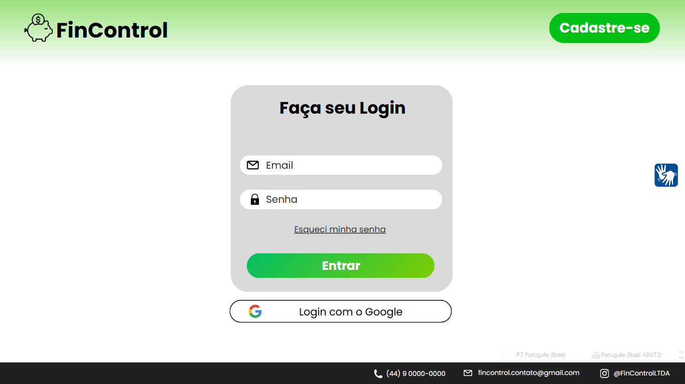

Ponto de entrada do sistema. O usuário autentica com email e senha ou via Google OAuth. O header exibe o botão "Cadastre-se" para redirecionar novos usuários.

| Elemento | Comportamento |
|---|---|
| Campo Email | Input com ícone de envelope |
| Campo Senha | Input com ícone de cadeado |
| Esqueci minha senha | Link para recuperação de senha |
| Botão Entrar | Submete via `POST /usuarios/login` |
| Login com o Google | Inicia OAuth; envia `idToken` via `POST /usuarios/login-google` |
| Botão Cadastre-se (header) | Navega para Tela 2 |

---

## Tela 2 — Cadastro

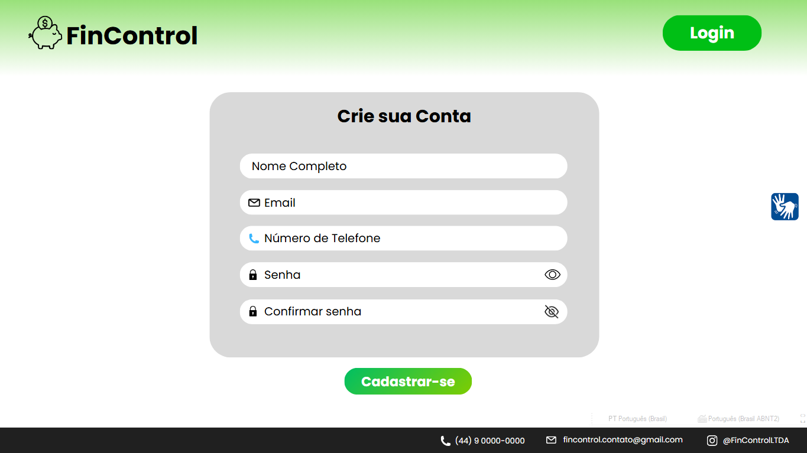

Formulário para criação de conta. O header troca o botão para "Login", permitindo que o usuário já cadastrado retorne.

| Elemento | Comportamento |
|---|---|
| Nome Completo | Input texto |
| Email | Input com ícone de envelope |
| Número de Telefone | Input com ícone de telefone |
| Senha | Input com botão de revelar (olho aberto) |
| Confirmar senha | Input com botão de ocultar (olho riscado) |
| Botão Cadastrar-se | Submete via `POST /usuarios` |

> A confirmação de senha é validada apenas no frontend — o backend recebe somente `senha_usuario`.

---

## Tela 3 — Criar Conta Bancária

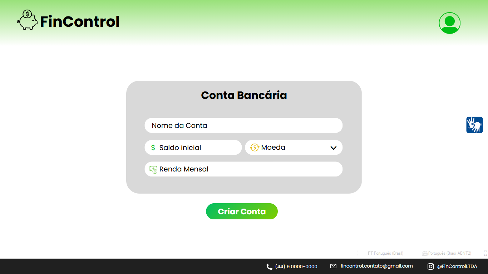

Exibida após o primeiro login. Guia o usuário a criar sua primeira conta financeira. O header passa a mostrar apenas o avatar de perfil, indicando sessão ativa.

| Elemento | Comportamento |
|---|---|
| Nome da Conta | Identificação livre (ex: "Nubank") |
| Saldo inicial | Valor numérico inicial da conta |
| Moeda | Dropdown para seleção de moeda (BRL, USD, EUR) |
| Renda Mensal | Campo informativo (funcionalidade futura) |
| Botão Criar Conta | Submete via `POST /contas` |

---

## Tela 4 — Dashboard

Tela principal do sistema. Concentra a maior parte das interações — listagem de transações, seleção de conta, filtros, e ações sobre cada transação.

### 4.1 Estado padrão

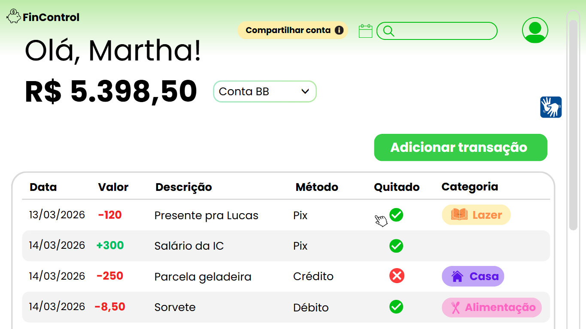

Exibe saudação personalizada, saldo da conta ativa e tabela de transações. O botão "Adicionar transação" abre a Tela 7 (Nova Transação) ou um modal equivalente.

| Elemento | Comportamento |
|---|---|
| "Olá, [nome]!" | Nome vem do retorno do login |
| Saldo em destaque | `saldo_conta` da conta selecionada |
| Dropdown de conta | Alterna entre contas do usuário |
| Compartilhar conta | Exibe badge com link copiável da conta |
| Ícone de calendário | Abre filtro por data (ver 4.5) |
| Campo de busca | Filtra transações por descrição/categoria |
| Avatar (header) | Abre painel de perfil (ver Tela 6) |
| Botão Adicionar transação | Navega para Tela 7 |
| Tabela de transações | Data, Valor, Descrição, Método, Quitado, Categoria |

Na tabela, valores com `entrada = TRUE` são exibidos em verde com `+`; valores com `entrada = FALSE` em vermelho com `-`. A coluna "Quitado" exibe ✅ ou ❌ conforme o campo `quitado`.

### 4.2 Dropdown de contas — lista

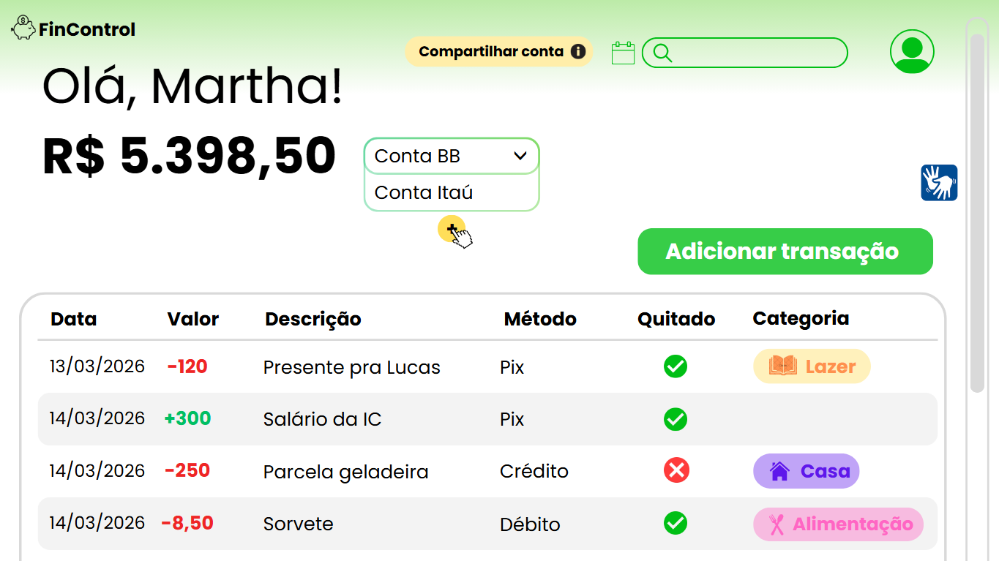

Ao abrir o dropdown, são listadas as contas do usuário (ex: Conta BB, Conta Itaú). Um botão `+` aparece abaixo da lista.

### 4.3 Dropdown de contas — ações

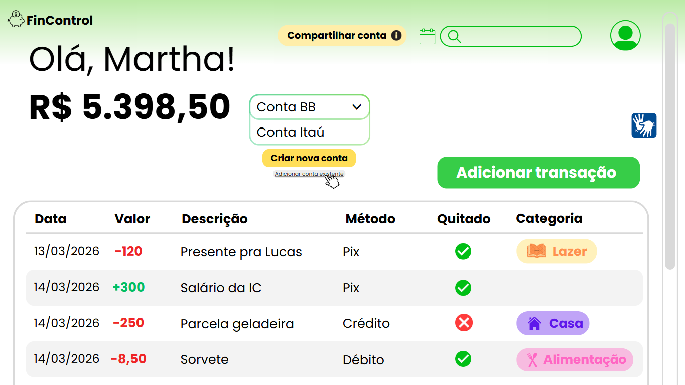

Clicar no `+` expande as opções: **Criar nova conta** (navega para Tela 3) e **Adicionar conta existente** (abre modal da seção 4.4).

### 4.4 Modal — Adicionar conta existente via link

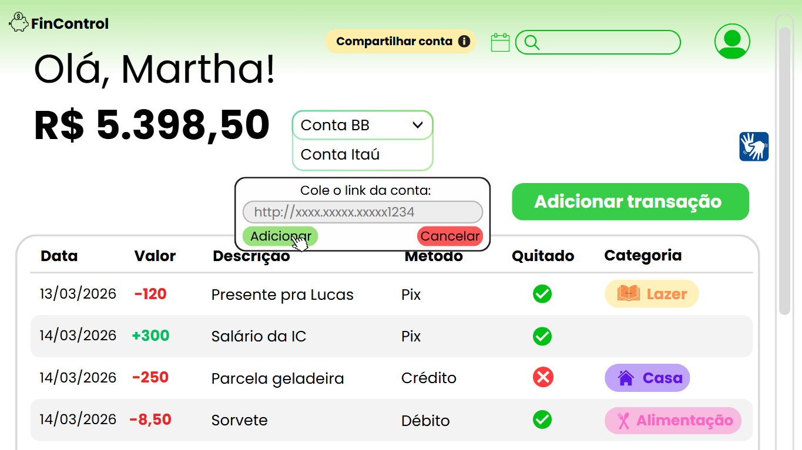

O usuário cola o link de compartilhamento de uma conta de outro usuário para vinculá-la à sua carteira. Botões "Adicionar" e "Cancelar".

### 4.5 Conta compartilhada no dropdown

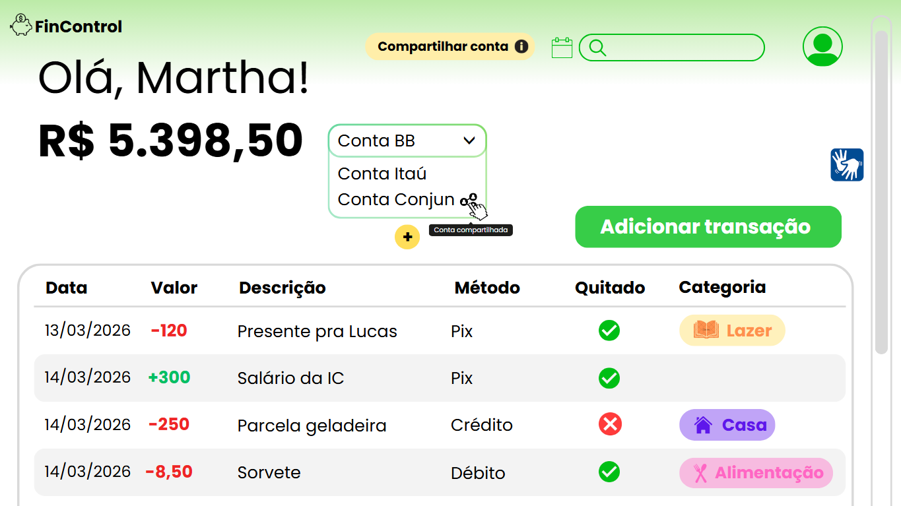

Contas adicionadas via link de compartilhamento aparecem no dropdown com um ícone de perfil duplo e tooltip "Conta compartilhada", diferenciando-as das contas próprias.

### 4.6 Filtro por data — calendário

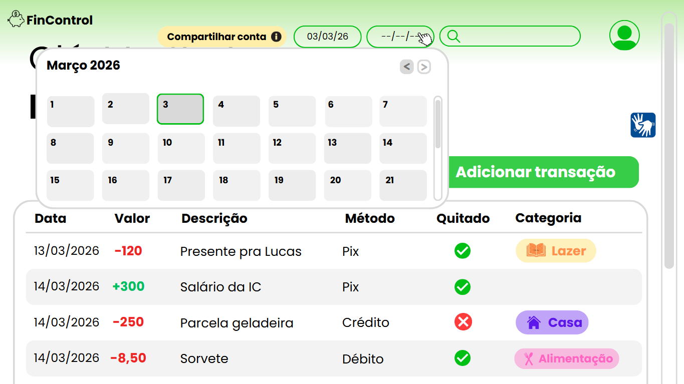

O ícone de calendário no header abre um date picker para selecionar um intervalo de datas. Dois campos de data aparecem no header (data início e data fim) para delimitar o período exibido na listagem.

### 4.7 Menu contextual de transação

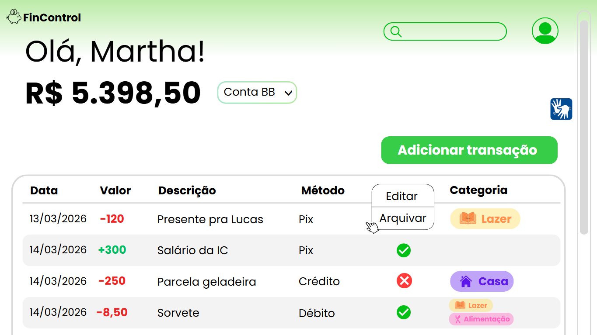

Clicar na coluna "Quitado" de uma transação (ou em um ícone de ação) abre um menu com duas opções: **Editar** e **Arquivar**.

### 4.8 Confirmação de arquivamento

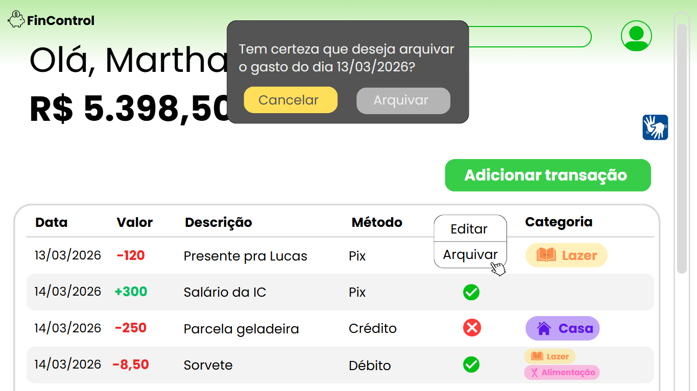

"Arquivar" abre um dialog de confirmação: *"Tem certeza que deseja arquivar o gasto do dia [data]?"* com botões "Cancelar" e "Arquivar". A ação seta `arquivado = TRUE` no banco — a transação não é deletada.

### 4.9 Modal de edição de transação

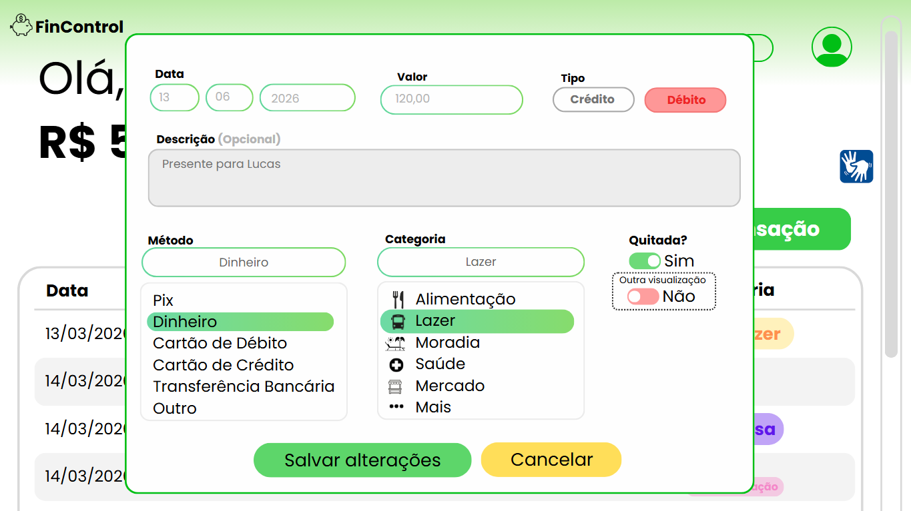

"Editar" abre um modal com os campos da transação preenchidos:
- Data (dia, mês, ano separados)
- Valor
- Tipo: toggle Crédito / **Débito** (selecionado)
- Descrição (opcional)
- Método: dropdown com Pix, Dinheiro, Cartão de Débito, Cartão de Crédito, Transferência Bancária, Outro
- Categoria: dropdown com Alimentação, Lazer, Moradia, Saúde, Mercado, Mais
- Quitada: toggle Sim / Não com indicação "Outra visualização" para o estado não selecionado

Botões: **Salvar alterações** e **Cancelar**.

---

## Tela 5 — Arquivados e Relatório Mensal

Esta tela é uma continuação de scroll do Dashboard — não é uma rota separada, mas uma seção que aparece abaixo da listagem de transações ativas.

### 5.1 Seção Arquivados

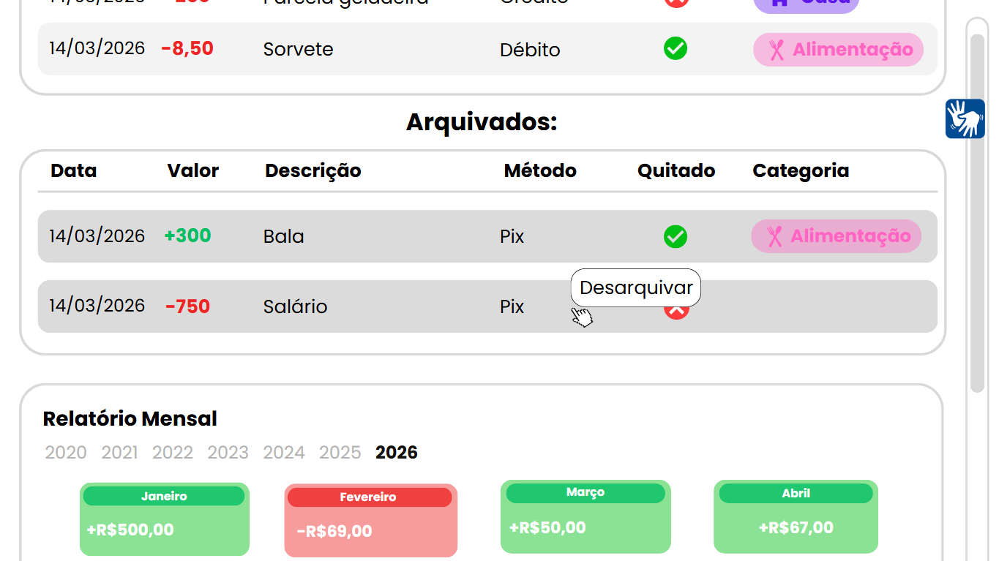

Logo abaixo da tabela principal, aparece a seção "Arquivados:" com outra tabela listando transações com `arquivado = TRUE`. Cada linha tem a opção **Desarquivar** ao passar o mouse, que reverte `arquivado` para `FALSE`.

### 5.2 Relatório Mensal — Grid de meses

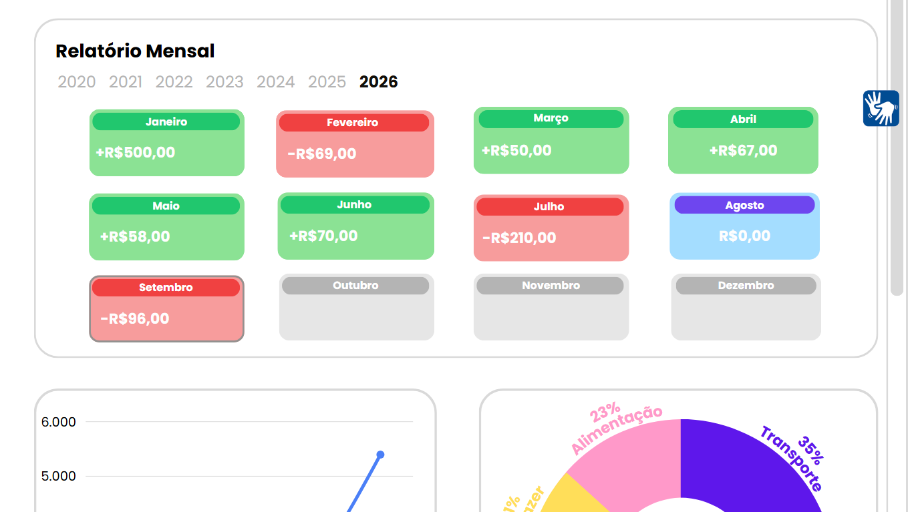

Abaixo da seção de arquivados, o Relatório Mensal exibe um grid com todos os meses do ano selecionado. Cada mês é um card colorido:
- **Verde** → saldo positivo no mês
- **Vermelho** → saldo negativo
- **Azul claro** → sem movimentação (R$0,00)
- **Cinza** → mês sem dados

O ano é selecionável por uma linha de anos (2020–2026). O mês atual é destacado com borda.

### 5.3 Relatório Mensal — Gráficos

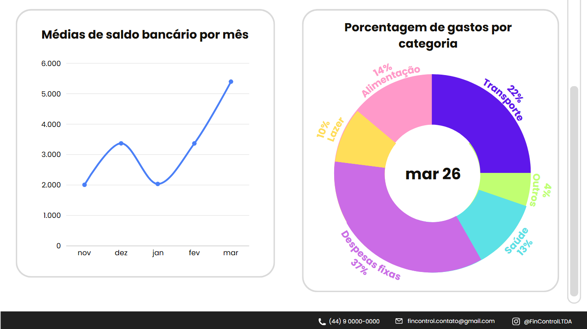

Dois gráficos lado a lado no final do relatório:

**Médias de saldo bancário por mês** — gráfico de linha mostrando a evolução do saldo ao longo dos últimos meses.

**Porcentagem de gastos por categoria** — gráfico donut com fatias por categoria (ex: Transporte 22%, Despesas fixas 37%, Alimentação 14%, Saúde 13%, Lazer 10%, Outros 4%). O mês de referência é exibido no centro do donut.

---

## Tela 6 — Painel de Perfil

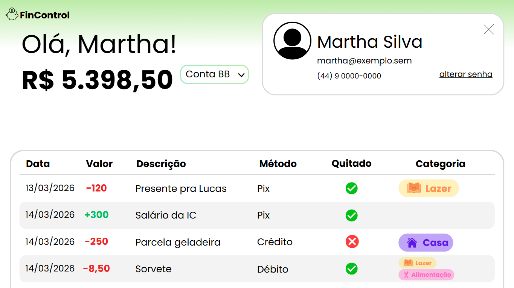

Clicando no avatar do header, um painel sobreposto exibe os dados do usuário logado: foto de perfil, nome completo, email e telefone, além de um link "alterar senha". O painel é fechado pelo botão `×`. Não é uma rota separada — é um overlay sobre o Dashboard.

---

## Tela 7 — Nova Transação

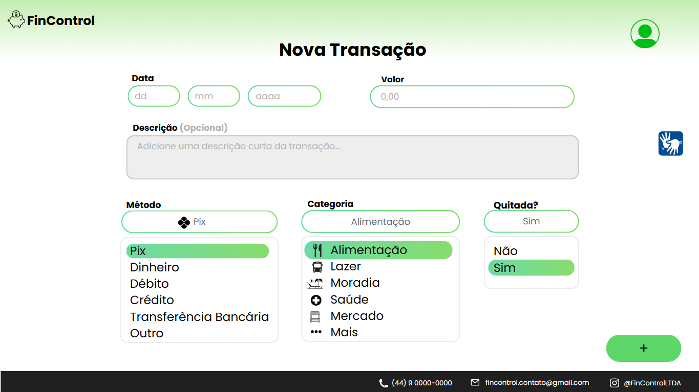

Tela separada (rota própria) para criação de novas transações. Acessada pelo botão "Adicionar transação" no Dashboard.

| Campo | Detalhes |
|---|---|
| Data | Três inputs separados: dd / mm / aaaa |
| Valor | Input numérico (0,00) |
| Descrição | Textarea opcional |
| Método | Dropdown: Pix, Dinheiro, Débito, Crédito, Transferência Bancária, Outro |
| Categoria | Dropdown: Alimentação, Lazer, Moradia, Saúde, Mercado, Mais |
| Quitada? | Toggle Sim / Não |
| Botão `+` (FAB) | Confirma criação; submete via `POST /transacoes` |

Diferente do modal de edição (Tela 4.9), esta é uma página dedicada — o que sugere que o botão do Dashboard pode tanto abrir o modal quanto navegar para esta rota dependendo do contexto.
